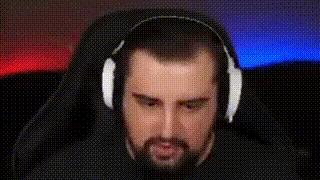

## Описание проекта

Тестовое задание  Фронтенд-разработчик в VK Музыку.

Макеты: https://www.figma.com/design/9d3ErSuSrLY1qCuSRPk80C/AudioCell?node-id=1-14582&t=Pyz9xH976E97kED1-0

В рамках задачи реализовал виджет списка треков.

Вроде Pixel Perfect 👉👈

Также реализовал визуализацию звука в canvas, фича AudioPlayer, с гибкой настройкой отображения и использованием нативных браузерных API 😎, которую можно было бы развивать далее. 

Добавил slider с перематыванием трека, регулировку громкости (по дизайну её не было, я не знал, нужна она или нет, решил добавить)


## Архитектура

### FSD


<a href="https://feature-sliced.design/docs/get-started/overview">Подробнее 🚀</a>

Выбрал именно эту архитектуру, потому что она идеально подходит для расширения и безболезненного масштабирования проекта

## Технологии

### Node.js 21.0.0


### TypeScript 5.2.2


### React: v18.2.0


### MobXv6.12.4


### VKUI: v6.1.1


### Prettier: v3.2.5


### Eslint: v8.57.0


### Webpack 5.88.2


### SCSS Modules


- Sass: 1.69.0
- Sass-loader: 13.3.2

## Установка и запуск проекта

1. Клонируйте репозиторий:
   ```bash
   git clone https://github.com/PavelPotapov/testVK.git
   ```
2. Установите зависимости:
   ```bash
   cd testVK
   npm install
   ```
3. Запуск
   ```bash
   npm start
   ```
4. Сборка для разработки
   ```bash
   npm run build:dev
   ```
5. Продакшн

   ```bash
   npm run build:prod
   ```

Мой тг

###  [PavelPotapov](https://t.me/Pavel_Potapov)
